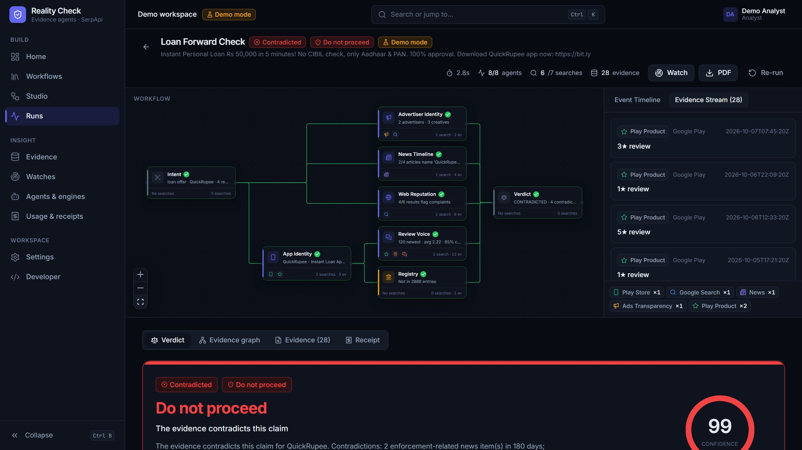
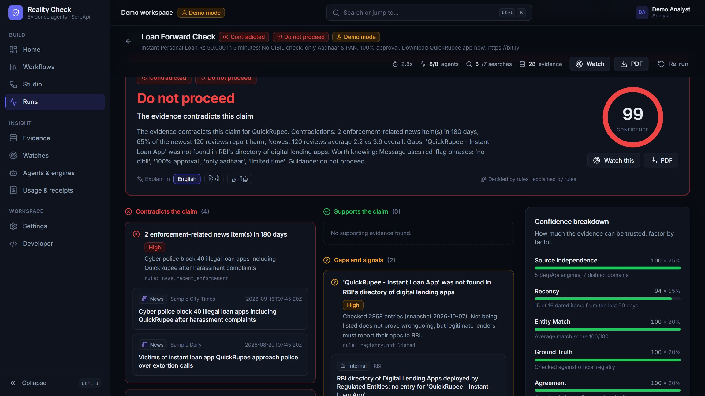
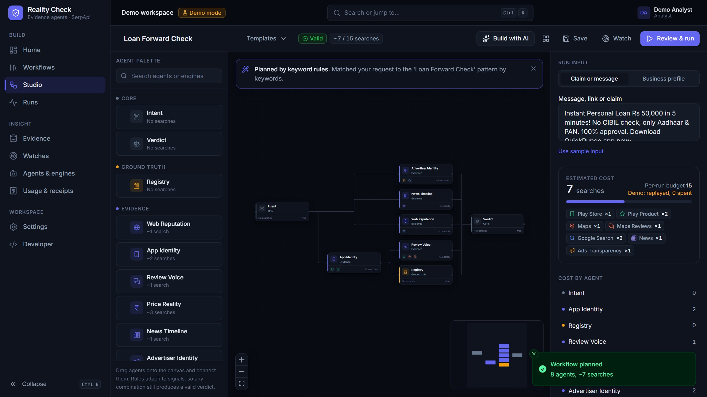
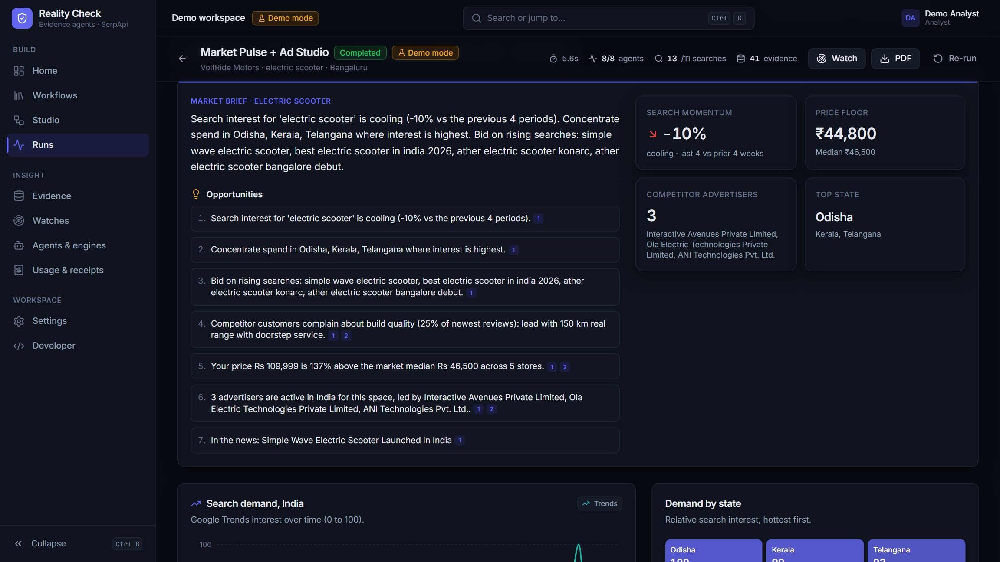
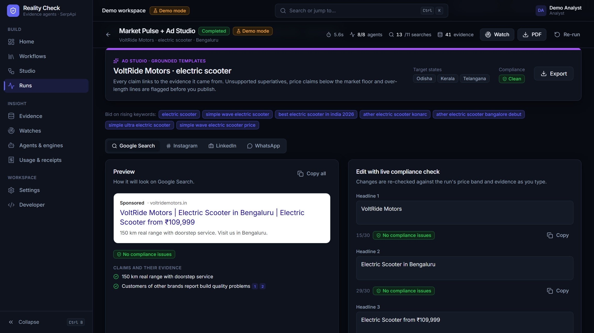

# Reality Check

**Reusable SerpApi evidence agents, composed into visual workflows. Verify before you trust, buy, invest, or act.**

Every Indian phone receives the same forwards: an instant loan with "no CIBIL check", a stock tip with "guaranteed
returns", a part-time job that needs a "registration fee", a customer-care number found in a search ad. An LLM on its
own can only guess. Reality Check answers with **live Google evidence** collected through SerpApi, shows every
source, and explains its verdict in plain language.

The same agents also work for businesses. **Market Pulse** reads Google Trends, News, Shopping, Maps reviews and the Ads
Transparency Center for a product. The **Ad Studio** then writes ad copy where every claim is grounded in that evidence
and checked against ASCI-style substantiation rules.

> Built solo by **Ramasamy P** (AI Engineer) for the SerpApi India Hackathon 2026 ·
> [ramasamy.p2105@gmail.com](mailto:ramasamy.p2105@gmail.com) · [@ramasamyp-aiengineer](https://github.com/ramasamyp-aiengineer)



---

## What it does

1. **Paste anything.** A WhatsApp forward, a link, a stock tip, or a business profile.
2. **Pick or AI-build a workflow.** The planner turns the input into a typed graph of agents. You can also drag agents
   onto the canvas yourself, Cursor-style. Each workflow shows its search cost before it runs.
3. **Approve and watch it run.** Agents light up live (Server-Sent Events), searches stream in, and evidence cards
   appear as they are found.
4. **Read the verdict.** Deterministic rules decide the verdict, and the LLM (if configured) only explains it. The
   report includes:
   - an evidence status of **CORROBORATED**, **CONTRADICTED**, **UNVERIFIED** or **INSUFFICIENT_EVIDENCE**;
   - a decision of Do not proceed, Proceed with caution, Wait and verify more, or Safe to proceed;
   - a confidence score, findings linked to evidence, an evidence graph, a PDF report and a search receipt.
5. **Watch it.** Re-run on a schedule and get a Telegram or email alert when the evidence changes.
6. **Use it from your AI tools.** The same agents are exposed as an MCP server for Cursor, Claude Desktop or any MCP
   client.

### Hero flows

| Flow | Input | What the agents find |
|---|---|---|
| Loan forward check | "Instant Personal Loan Rs 50,000 … No CIBIL check … Download QuickRupee app" | Play Store identity, missing from RBI's digital-lending directory, harm topics in the newest reviews, complaint sites, enforcement news, the advertiser behind the ads, and finally **CONTRADICTED / Do not proceed** |
| Market Pulse + Ad Studio | Business profile: electric scooter, Bengaluru, Rs 1,09,999 | Demand momentum, top states, rising searches, the price band across stores, competitor review pain points and active advertisers. The output is a market brief and grounded Google, Meta and WhatsApp ad variants |

<table>
  <tr>
    <td></td>
    <td></td>
  </tr>
  <tr>
    <td></td>
    <td></td>
  </tr>
</table>

### Workflow templates

| Template | Agents | Est. searches |
|---|---|---|
| Loan Forward Check | intent, app identity, registry (RBI), review voice, web reputation, news, advertiser identity, verdict | 6 |
| Market Pulse + Ad Studio | intent, demand trend, news, price reality, advertiser identity, review voice (Maps), market brief, ad agent | 9 |
| Buy Decision | intent, price reality, web reputation, verdict | 4 |
| Competitor Watch | intent, advertiser identity, news, demand trend, market brief | 4 |
| Investment Tip Check | intent, registry (SEBI), market quote, web reputation, news, verdict | 3 |
| Job Offer Check | intent, Google Jobs, Google Maps, web reputation, verdict | 3 |
| Customer Care Number Check | intent, web reputation, Google Maps (listed phone), verdict | 2 |
| Local Service Check | intent, Google Maps, Maps reviews, web reputation, verdict | 4 |
| Image Provenance Check | intent, Google Lens exact matches, web reputation, verdict | 2 |
| Trip Timing | intent, Google Hotels, news, Google Trends, verdict | 3 |

Every run is capped by a per-run search budget (default 15) and a monthly workspace budget. Repeated searches are
served from a local SQLite cache and cost nothing.

---

## Engine Atlas: 16 SerpApi engines

| Engine | Agent(s) | What it proves |
|---|---|---|
| `google_light` | Web Reputation | Complaints, scam warnings and the official site across the open web |
| `google_play` | App Identity | Whether the promoted app exists on Play and who publishes it |
| `google_play_product` | App Identity, Review Voice | Developer identity, installs, and the newest reviews sorted by date |
| `google_maps` | Place Reality, Review Voice | That a business physically exists, with address, phone and rating |
| `google_maps_reviews` | Review Voice | What customers say right now, with Google's own topic counts |
| `google_news` | News Timeline | Dated events: enforcement, complaints, launches, price changes |
| `google_ads_transparency_center` | Advertiser Identity | Which verified advertiser pays for the ads, and their creatives |
| `google_shopping` | Price Reality | Live prices from Indian stores for the exact product |
| `google_immersive_product` | Price Reality | The full store list and prices for one product |
| `amazon` (amazon.in) | Price Reality | The Amazon India price as an independent reference |
| `google_trends` | Demand Trend | Demand over time, interest by Indian state, rising searches |
| `google_lens` | Visual Provenance | Where else an image appears online (reused "proof" screenshots) |
| `google_flights` | Travel Price | Real fares and whether today's price is low, typical or high |
| `google_hotels` | Travel Price | Real nightly rates for a destination and date |
| `google_finance` | Market | The live NSE quote behind a stock tip |
| `google_jobs` | Jobs Demand | Whether an employer is really hiring for the role |

There are 17 agents in total. Besides the 12 evidence agents there are Intent, Registry (offline RBI and SEBI
snapshots), Market Brief, Ad Studio and Verdict. The agents feed **30 deterministic verdict rules**, which you can
browse in the app under *Agents → Verdict rules*. Every agent and rule is listed in
[docs/agents-and-rules.md](docs/agents-and-rules.md).

---

## Quick start

Requirements: Python 3.11 or newer, Node 20 or newer, and optionally [uv](https://docs.astral.sh/uv/).

```bash
git clone https://github.com/ramasamyp-aiengineer/reality-check.git
cd reality-check

# 1. Python backend
uv sync                       # or: python -m venv .venv && .venv/Scripts/pip install -e .   (Windows)
                              #     python -m venv .venv && .venv/bin/pip install -e .       (macOS/Linux)

# 2. Web UI
cd apps/web && npm install && npm run build && cd ../..

# 3. Run
uv run reality-check --demo   # or: .venv/Scripts/reality-check --demo
```

Open <http://127.0.0.1:8000>. Two modes run side by side:

| | Demo workspace | Your workspace |
|---|---|---|
| How to enter | **Try the demo workspace** on the sign-in page | Create the admin account on first start, then sign in |
| Evidence | Recorded SerpApi responses, replayed | Live SerpApi searches with your key |
| Cost | Nothing is spent, no key needed | Shown and approved before every run |

Signed-in admins can open the demo from the account menu and come back with **Back to my workspace**, without signing
in again. An admin can also switch their own workspace to replay in *Settings*.

### Live searches

```bash
cp .env.example .env          # add SERPAPI_API_KEY (and optionally LLM_MODEL plus a provider key)
uv run reality-check --demo   # live for your workspace, demo workspace still available
```

You can also paste your own SerpApi key in the UI under *Connect SerpApi*; by default it lives only in your session.
Use `--demo-only` for fully offline judging: every workspace replays recordings and no search is ever made.

### Development

```bash
uv run reality-check --reload           # API on :8000
cd apps/web && npm run dev              # UI on :5173, proxies /api to :8000
```

### Recording real fixtures for the offline demo

Demo mode replays recorded responses. The repo ships two kinds:

- **Real SerpApi recordings** in `fixtures/serp/`, with the key scrubbed. They cover Market Pulse + Ad Studio,
  Competitor Watch, Buy Decision, Trip Timing, Investment Tip and Image Provenance.
- **Synthetic sample fixtures** in `fixtures/sample/`. They cover flows whose sample inputs are fictional (the
  QuickRupee loan forward, the customer-care, job and clinic checks), carry `"_synthetic": true`, and are labelled
  "sample data" in the UI.

The **RBI Digital Lending Apps registry is the official list**: 2,868 listings (1,153 apps from 457 regulated
entities), exported on 7 Oct 2026 from RBI's public directory (rbi.org.in home page, "DLAs deployed by Regulated
Entities", served from data.rbi.org.in). Only app, owner, lender, platform and link columns are kept; grievance-officer
contact details are dropped. Matching uses the Play Store package id first, then a name match that ignores generic
lending words ("instant", "loan", "rupee"…), so look-alike apps are not mistaken for registered ones. The SEBI
snapshot is still a sample. Refresh the RBI list with `node scripts/fetch-rbi-dla.mjs` (run in `apps/web`), or import
any export with `python -m evidence_agents.tools.import_registry rbi_dla export.xlsx`.

To record more real responses:

```bash
record-fixtures                                    # hero workflows, hard budget of 30 searches
record-fixtures loan_forward_check --budget 10
record-fixtures market_pulse_ads --text "..."      # custom input
```

Real recordings go to `fixtures/serp/` with the API key scrubbed, and they always take precedence over samples.

---

## Security model

- **SerpApi key**
  - The key is never logged and never returned to the browser. The UI only sees `****abcd`.
  - It is session-only by default. Saving it is opt-in, and saved keys are encrypted with **AES-256-GCM**, bound to the
    workspace (associated data) and stored in SQLite.
  - The key is redacted from errors, receipts, cache keys and recorded fixtures. Tests assert this.
- **Authentication**
  - Passwords are hashed with Argon2id, and login errors are generic.
  - Accounts lock for 15 minutes after repeated failures, and auth endpoints are rate-limited (slowapi).
- **Sessions**
  - Sessions use `HttpOnly`, `SameSite=Strict` cookies, with `Secure` behind HTTPS.
  - Every state-changing request needs a double-submit CSRF token.
- **Roles**: admin, analyst and viewer. Settings, members and the audit log are admin-only, and the demo workspace is
  read-only for settings.
- **Audit log** of sign-ins, key changes, runs, settings, members and tokens. Secrets are never written to it.
- **SSRF guard**: user-supplied URLs, such as images for Google Lens, must be public http(s) URLs. Private, loopback,
  link-local and metadata addresses are rejected, both as literal IPs and after DNS resolution.
- **Security headers**: CSP, HSTS (behind HTTPS), `X-Frame-Options: DENY`, `nosniff`, Referrer-Policy and
  Permissions-Policy.
- **Prompt-injection hygiene**: untrusted text is fenced before it reaches the LLM. The LLM never decides the verdict;
  rules do.
- **Responsible wording**: verdicts describe *evidence status*. The app never labels a person or company "fraud", and
  every finding links to its sources.
- **API tokens** (`rc_…`) for REST and automation. They are stored hashed, shown once, and revocable.

---

## MCP server

```json
{
  "mcpServers": {
    "reality-check": {
      "command": "uv",
      "args": ["run", "--directory", "/path/to/SerpAPI", "reality-check-mcp"],
      "env": { "SERPAPI_API_KEY": "your-key", "RC_MAX_SEARCHES": "10" }
    }
  }
}
```

The server exposes six tools: `list_agents`, `list_workflows`, `run_agent`, `verify_claim`, `market_pulse` and
`run_workflow`. Without a key, or with `RC_MODE=demo`, it replays fixtures. The *Developer* page in the app generates
this config for Claude Desktop, Cursor and the CLI.

## REST API

```bash
TOKEN=rc_...   # create one under Developer → API tokens
curl -X POST http://127.0.0.1:8000/api/runs -H "Authorization: Bearer $TOKEN" -H "Content-Type: application/json" \
  -d '{"workflow_id":"loan_forward_check","approved":true,"input":{"text":"Instant loan, no CIBIL check, download QuickRupee app"}}'
curl -N http://127.0.0.1:8000/api/runs/<id>/events -H "Authorization: Bearer $TOKEN"     # live SSE stream
curl http://127.0.0.1:8000/api/runs/<id> -H "Authorization: Bearer $TOKEN"               # verdict + evidence
curl -o report.pdf http://127.0.0.1:8000/api/runs/<id>/report.pdf -H "Authorization: Bearer $TOKEN"
```

---

## Tests

```bash
uv run pytest -q                      # 90 tests: engine, verdicts, rules, registry, SerpApi client, SSRF, API, auth, keys
cd apps/web && npx playwright test    # end-to-end: demo sign-in, loan hero, market pulse + ads, every page renders
```

The tests cover key redaction (in receipts, errors and fixtures), budget enforcement, deterministic verdicts, a grounded
verdict for every trust template, ad length limits, CSRF, roles, the SSRF guard, and the rule that the secret never
appears in responses, the database or the audit log.

## Architecture

The architecture is covered in [docs/architecture.md](docs/architecture.md). In short:

- `packages/evidence_agents` contains the agents, typed signals (Pydantic), the DAG executor, rules and verdict, the
  SerpApi client (cache, budget, redaction, replay), the planner and the LLM adapters (Pydantic AI).
- `apps/api` is FastAPI with SQLite, SSE, auth, watches (APScheduler) and PDF reports.
- `apps/mcp` is the MCP server.
- `apps/web` uses React 19, TypeScript, Vite, Tailwind v4, React Flow, TanStack Router, Query and Table, Recharts and
  Motion.
- `workflows/` holds the JSON workflow templates, and `fixtures/` holds recorded and sample SerpApi responses.

## AI tool disclosure

- **Development tools:** Cursor (AI-assisted coding).
- **At runtime**, an optional LLM (any Pydantic AI provider: OpenAI, Anthropic, Gemini or Groq) parses claims, plans
  workflows, explains verdicts and drafts ad copy. The app works fully without an LLM: heuristics parse claims and
  deterministic rules decide every verdict.

All evidence comes from SerpApi. The synthetic sample fixtures are clearly labelled and use fictional names.

## License

MIT
